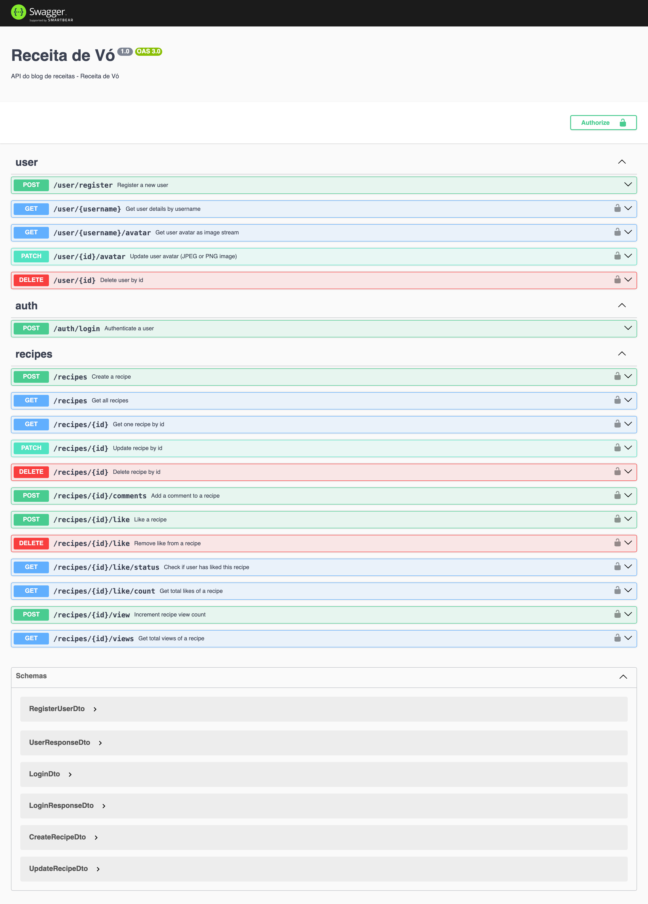

# Receita de Vó 🍲

API backend para um sistema de receitas culinárias, construída com NestJS, MongoDB e Redis.

## Features

- Cadastro, autenticação e gerenciamento de usuários
- Criação, edição, remoção e listagem de receitas
- Upload de imagem da receita (base64)
- Comentários em receitas (subdocumentos)
- Contador de visualizações (views) por receita usando Redis
- Likes únicos por usuário em cada receita usando Redis
- Endpoints protegidos por autenticação JWT
- Documentação automática com Swagger
- Sincronização entre Redis e MongoDB para persistência de dados

## Tecnologias

- [NestJS](https://nestjs.com/)
- [MongoDB](https://www.mongodb.com/)
- [Mongoose](https://mongoosejs.com/)
- [Redis](https://redis.io/)
- [Swagger](https://swagger.io/)

## Instalação

```bash
git clone git@github.com:Pettecco/receita-de-vo-backend.git
cd receita-de-vo-backend
npm install
```

## Configuração do Ambiente

Copie o arquivo de exemplo e configure suas variáveis:

```bash
cp .env.example .env
```

Edite o arquivo .env conforme necessário (siga o .env.example):
```
JWT_SECRET=sua_senha_secreta
MONGO_URI=mongodb://mongo:27017/revo
REDIS_URL=redis://redis:6379
PORT=3000
HOST=0.0.0.0
```

## Rodando com Docker Compose

```bash
 docker compose up --build
```
Acesse a documentação Swagger em:
http://localhost:3000/docs

## Rodando sem Docker

Para rodar o projeto localmente sem usar Docker, siga os passos abaixo:

   * Garanta que o MongoDB e o Redis estejam instalados e rodando na sua máquina.

   * Configure as variáveis de ambiente no arquivo .env com as URLs corretas para seus serviços locais (ex: localhost).

   * Instale as dependências (se ainda não instalou):

```bash
npm install
```
Execute a aplicação:

```bash
npm run start:dev      # roda em modo desenvolvimento
npm run start:prod     # roda em modo produção
```
Após iniciar a aplicação, acesse:

  * Interface da API: http://localhost:3000

  * Documentação Swagger: http://localhost:3000/docs


### Rotas



